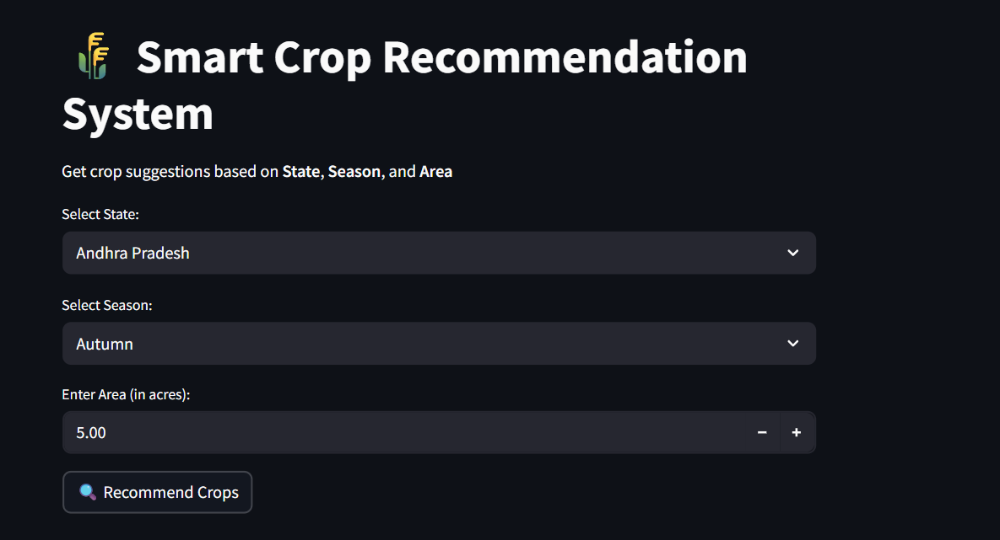

# 🌾 AgriAI – Smart Crop Recommendation System

AgriAI is a **Machine Learning–based agricultural assistance system** designed to help farmers make better crop selection decisions.  
The system recommends suitable crops based on **State, Season, and Cultivation Area**, along with fertilizer, pesticide, yield estimation, and live weather updates.

---

## 🚀 Features

- ✅ Crop recommendation using **Random Forest Classifier**
- 🌱 Top 3 crop suggestions with confidence scores
- 🌦️ Live weather information using **wttr.in API**
- 💧 Fertilizer and 🐛 pesticide recommendations
- 🌾 Yield estimation based on land area
- 🖥️ User-friendly interface built with **Streamlit**

---

## 🧠 Machine Learning Details

- **Type:** Supervised Machine Learning
- **Algorithm:** Random Forest Classifier
- **Input Features:** State, Season
- **Target Variable:** Crop
- **Evaluation:** Accuracy score and confusion matrix

---

## 🛠️ Technologies Used

- **Programming Language:** Python  
- **ML Library:** scikit-learn  
- **Frontend:** Streamlit  
- **Data Handling:** Pandas, NumPy  
- **Visualization:** Matplotlib, Seaborn  
- **API:** wttr.in (Weather)  

---

## ⚙️ How the System Works

1. User selects **State**, **Season**, and enters **Area (in acres)**
2. Inputs are preprocessed using **Label Encoding**
3. Trained ML model predicts top suitable crops
4. Weather data is fetched in real-time
5. Fertilizer, pesticide, and yield details are displayed

---

## 🌐 Live Demo

🚀 Try the live application here:  
👉 **https://agriai-smart-crop-recommendation.streamlit.app/**

## 📸 Screenshots

### Home Page


### Crop Recommendation Output


---

## ▶️ How to Run the Project Locally

```bash
pip install -r requirements.txt
streamlit run crop_recommendation_app.py
